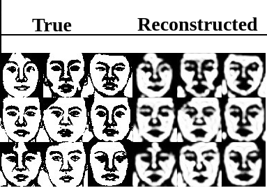
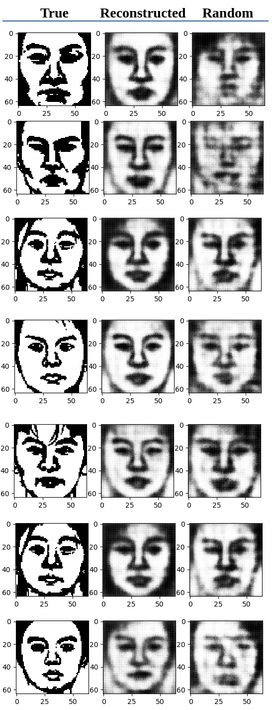

## Introduction
The goal of this project is to explore autoencoders and variational autoencoders to generate images of faces.

* Autoencoders has been implemented on the CUFS dataset

* VAE's have been implemneted on the CUFS and CelebA datasets

Refer the handout and report for more details.

## Results
`Autoencoder results (on CUFS)`

 

`Variational autoencoder results (on CUFS)`

 

`Variational autoencoder results (on CelebA)`

 

